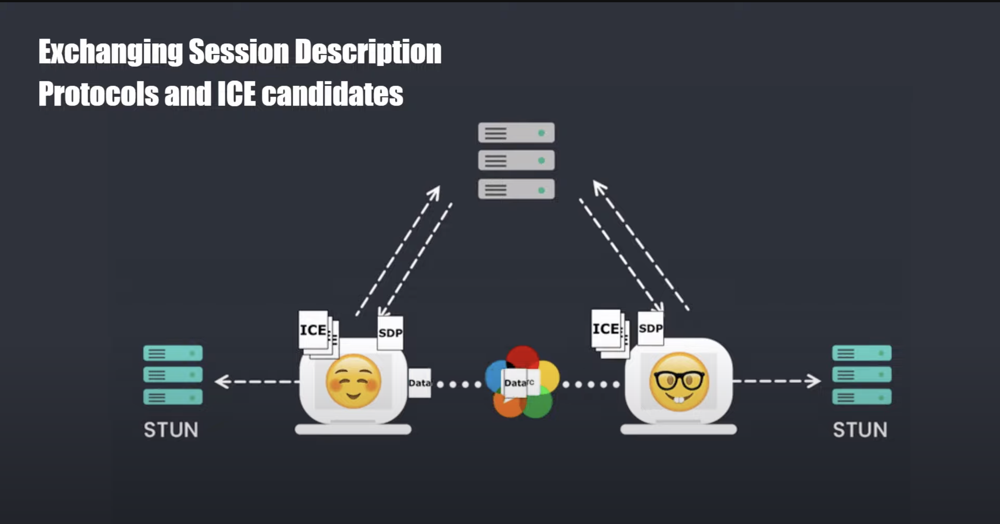

## WebRTC

In order to establish a real-time connection between two peers WebRTC uses a signaling server first to exchange information about the connection. After that the peers can connect directly to each other.

The signaling server is used to exchange information about the connection. This includes the following:

- Session Description Protocol (SDP) - An object containing information about the connection such as codec, address, media type, etc.
- ICE () Candidates - A list of possible ways to connect to the peer. This includes the IP address and port number that could potentially receive data.

